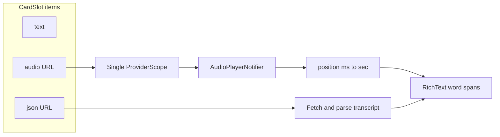

# Audio–text sync from transcript JSON

Design for highlighting card text in sync with playback, using the `retentio-transcript-sync` JSON attached as the card slot `json` media URL.

## Transcript JSON shape

Example source file: `content-engine/deck-material/请只管过好自己的人生.json`.

- **`format`**: `retentio-transcript-sync`
- **`version`**: e.g. `2`
- **`words`**: ordered tokens `{ "word": string, "start": number, "end": number }` with times in **seconds**
- **`text`**: full string (optional fallback; spacing may not align 1:1 with `words`, so prefer rendering from **`words[].word`** in order, concatenated without extra spaces for Japanese)
- **`duration`**, optional **`sentences`** / **`segments`** (may be empty; ignore for an initial implementation)

**Highlight rule:** at playback time `t` (seconds), choose index `i` where `words[i].start <= t < words[i].end`. In gaps between words, either keep the last word with `start <= t` or show no highlight.

## Pause and highlight

When the user **pauses**, keep using the **last known playback position** as `t`. The highlight should **stay** on the word that matches that position (no need to clear highlight on pause).

Implementation detail: store position in `AudioPlayerState` and update it from `onCurrentDurationChanged` while playing; on pause the stream may emit less often or stop—**avoid resetting position to zero** when pausing. If the platform stops sending updates while paused, the last value in state is still correct for highlighting.

## Seek / skip backward and forward

`audio_waveforms` **`PlayerController`** already supports **`seekTo(int progress)`** with **`progress` in milliseconds** (same units as `onCurrentDurationChanged`).

**Notifier:** expose thin wrappers on `AudioPlayerNotifier`, e.g. `seekToMs(int ms)` (clamp to `[0, maxDuration]`) and convenience `skipForward(Duration)` / `skipBackward(Duration)` that read current position + delta then call `seekTo`.

**UI (pick one or combine; all are small additions):**

1. **Waveform scrub** — `AudioFileWaveforms` may already support drag-to-seek; if so, wire it to the same controller and transcript highlight updates automatically from position.
2. **Skip buttons** — e.g. −15s / +15s (or −5s / +5s) next to the play button on the compact **`CardAudio`** control.
3. **Tap a word** — `GestureDetector` on each `TextSpan` (or `Text.rich` with `TapGestureRecognizer`): `seekToMs((word.start * 1000).round())`; optional small UX polish: pause after seek or keep playing.

After any seek, highlight recomputes from the new `t` (whether playing or paused).

## Frontend gap: `json` not parsed on slots

[`lib/models/card.dart`](../lib/models/card.dart) — `CardSlot.fromJson` synthesizes items from `text`, `audio`, `image`, `video` only. The API already returns `json` as a media URL (backend `entryToFaceObject` / `EntryObjectsWithMediaURLs`).

**Change:** `addIf("json", json["json"])` in the same path, after `audio` (order: text → audio → json → image → video). Add/update tests in `test/models/card_test.dart`.

## Playback time (keep `audio_waveforms`)

[`lib/screen/deck/providers/audio_player.dart`](../lib/screen/deck/providers/audio_player.dart) — `PlayerController` exposes:

- `onCurrentDurationChanged` → `Stream<int>` (position in **milliseconds**)
- Optionally `updateFrequency` on the controller for smoother UI

**Change:** subscribe alongside existing `onPlayerStateChanged`, map ms → seconds (or store ms), extend `AudioPlayerState` with a position field; cancel in `onDispose`. Use that position for both **playing** and **paused** highlight and as the base for **skip** operations.

## Riverpod scope: one player for audio + transcript text

[`CardAudio`](../lib/screen/deck/card_widgets/card_audio.dart) uses `ProviderScope` + `audioUrlProvider` unless `useExternalScope` is true. [`FactContent`](../lib/screen/deck/fact_widgets/fact_content.dart) lays out transcript / text in `_CombinedTextPane` above a scroll column and puts compact **audio** on a **bottom strip** when present — transcript and play controls are **siblings**, so the transcript subtree does not automatically see the same `audioPlayerProvider` unless the tree is wrapped once at a common ancestor.

**Change:**

- If **`audioItems.length == 1`**, wrap the **`FactContent` root** (the outer `Column` returned from `build`) in a **single** `ProviderScope` with `audioUrlProvider.overrideWithValue(thatUrl)`.
- **`CardAudio`:** stop nesting `ProviderScope` when the parent already provides scope (e.g. optional flag `useExternalScope`, or equivalent), so text and play button share one notifier.
- If **`audioItems.length != 1`**, keep per-control scopes (no transcript sync for multi-audio fields in v1).

## Transcript fetch and UI

1. **Model** (e.g. `lib/models/transcript_sync.dart`): parse JSON; require `format == retentio-transcript-sync` and non-empty `words`.
2. **Load/cache:** `FutureProvider` keyed by URL, or in-memory map by URL to avoid refetch on rebuilds; use the same authenticated download/GET path as other media (`ApiService` / Dio).
3. **Widget** (e.g. `lib/screen/deck/card_widgets/card_transcript_text.dart`): watch transcript + `audioPlayerProvider` position; `Text.rich` with one `TextSpan` per word (style aligned with [`CardText`](../lib/screen/deck/card_widgets/card_text.dart)); active span uses background or stronger color; optional **tap-to-seek** per word. On parse failure, fall back to `CardText`.
4. **`_CombinedTextPane`:** if exactly one `json` and one `audio` item (and single-audio scope applies), use the transcript widget; else existing `CardText` loop.

## Scope / non-goals

- **Backend / content-engine:** no change required if URLs are already correct.
- **Later:** auto-scroll so the active word stays in view during playback (optional `Scrollable.ensureVisible`).

## Files to touch (implementation checklist)

| Area | File |
|------|------|
| Parse `json` on slots | `lib/models/card.dart` |
| Tests | `test/models/card_test.dart` |
| Position + seek/skip | `lib/screen/deck/providers/audio_player.dart` |
| Scope + transcript branch | `lib/screen/deck/fact_widgets/fact_content.dart` |
| Optional scope on control; optional skip buttons / waveform seek | `lib/screen/deck/card_widgets/card_audio.dart` |
| New | `lib/models/transcript_sync.dart`, transcript text widget |

## Data flow

