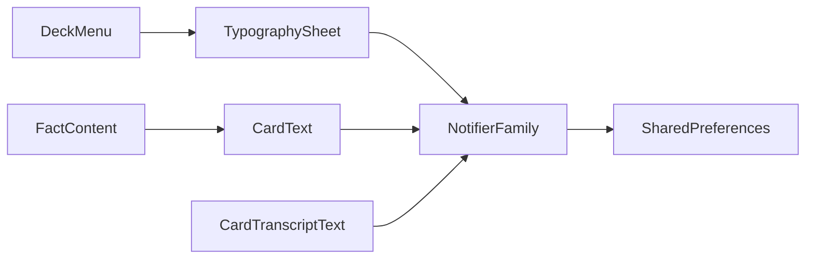

# Deck “Font” sheet: main text + ruby sliders (design)

**Status:** implemented (deck menu **Font** → sheet with sliders; `SharedPreferences` per deck id).  
**Related:** [card-text-markup.md](card-text-markup.md) (wiki-style `[[main|reading]]` format).

## Goals

- At **deck study** level, let the user set **two independent sizes**: main line (e.g. kanji) and ruby line (readings), via **sliders**.
- Use a **Japanese-capable font** for this typography (applied to rendered card text that uses wiki ruby) so sizing and preview match real study content.
- Show **default Japanese example text** in the settings UI (e.g. `[[例|れい]]の[[漢字|かんじ]]` or similar) so users see the effect immediately.
- Changes apply to **every card** in that deck while studying: `lib/screen/deck/card_widgets/card_text.dart`, `lib/screen/deck/card_widgets/card_transcript_text.dart` (ruby path), and `lib/screen/deck/card_widgets/card_wiki_ruby_layout.dart` (`wikiRubyWrappedText`, `wikiRubyReadingStyle`).

## Font (“word font” → working Japanese font)

- The app today has **no bundled CJK fonts** (`pubspec.yaml` has no `fonts:` entries; no `fontFamily` usage in `lib/`).
- **Recommended approach:** add **`google_fonts`** and use **Noto Sans JP** (or Noto Serif JP) for deck typography `TextStyle` so glyphs are predictable on all platforms.
- **Alternative (lighter dependency):** `fontFamilyFallback` with platform CJK families only—less consistent across devices.

## State and persistence

- Provider: `lib/screen/deck/providers/deck_card_typography.dart`
  - **`deckSidesTypographyProvider`** — **`NotifierProvider.family.autoDispose`** keyed by **`deck.id`**. (Renamed from an earlier `deckCardTypographyProvider` so hot reload does not keep a stale `DeckCardTypography` state registration.)
  - State: **`DeckCardSidesTypography`** — separate **`DeckCardTypography`** for **front** and **back** (main + ruby each).
  - **Defaults:** 18 / ~9.9 for both sides (same as original single setting).
  - **Persist:** `SharedPreferences` keys per side, e.g. `deck_typography_base_front_v1_<id>`, `deck_typography_ruby_front_v1_<id>`, `deck_typography_base_back_v1_<id>`, `deck_typography_ruby_back_v1_<id>`. Older keys `deck_typography_base_v1_<id>` / `deck_typography_ruby_v1_<id>` are **migrated** once to both sides and rewritten to the new keys.
  - Hydrate runs in a microtask after first frame (brief default flash acceptable).

## Wiring into widgets

- **`wikiRubyReadingStyle`:** accept **explicit ruby size** (and font family), or pass a fully built `TextStyle ruby` from the notifier—avoid hardcoded `0.55` as the only path.
- **`wikiRubyWrappedText`:** parameters for ruby style (or sizes + family) so ruby and base are independent.
- **`CardText` / `CardTranscriptText`:** optional **`typographyDeckId`** and **`typographyIsFront`** (defaults to **front**). Study UI passes `isFront` from `CardSideContent`.
- **`FactContent` / `_CombinedTextPane` / `CardContentContainer`:** thread **`typographyDeckId`** and **`typographyIsFront`**. `lib/screen/deck/card_widgets/card_side_content.dart` passes `deckProvider.id` and `isFront` for the visible card side.

## Deck-level UI entry

- **Menu:** In `lib/screen/deck/deck_widgets/deck_menu.dart`, add an item labeled **“Font”** (l10n key e.g. `font`; EN “Font”, ZH e.g. 字体 / 字型) that opens **`showCommonBottomSheet`** (same pattern as Add fact / Edit deck).
- **Sheet:** **Front / Back** segmented control; each side has its own preview + two sliders (main + ruby). Persist on slider **end**.

## Localization

- `lib/l10n/app_en.arb` / `app_zh.arb`: **menu “Font”**, sheet title, slider labels, **Front / Back** tab labels (`deckFontTabFront` / `deckFontTabBack`), preview caption.

## Edge cases

- **Ruby larger than base:** allowed; layout stacks reading above kanji in a `Column`.
- **Plain text cards** (no `[[|]]` markup): still honor **base font size** and font from the same typography state when `typographyDeckId` is set.

## Tests

- `test/screen/deck/deck_card_typography_test.dart` — `DeckCardTypography` / `DeckCardSidesTypography` models; hydrate (full, legacy, **partial front-only prefs**); **side-isolated** `setBaseFontSize`; `persistCurrent` (four keys); `CardText` (ruby front/back, **plain text**); **`CardTranscriptText`** back typography with annotated transcript; **`FactContent`** + `typographyIsFront: false`; `DeckFontSheet` (segment + **Back** tab slider writes **back** prefs only).
- Widget tests set `deckCardTypographyUsePlainTextStyleInTests` so `DeckCardTypography.baseTextStyle` skips Google Fonts HTTP (see `lib/screen/deck/providers/deck_card_typography.dart`).
- `test/screen/deck/card_wiki_ruby_layout_test.dart` — `wikiRubyReadingStyle` with explicit `rubyFontSize`.

## Implementation checklist

- [x] Add `google_fonts` (or chosen font strategy) and deck typography family notifier + `SharedPreferences` persistence.
- [x] Refactor `card_wiki_ruby_layout` / `wikiRubyWrappedText` for explicit base + ruby `TextStyle`s.
- [x] Thread `typographyDeckId` + `typographyIsFront` through `CardText`, `CardTranscriptText`, `FactContent`, `CardSideContent`.
- [x] Deck menu **Font** + bottom sheet + l10n.
- [x] Update/add widget tests.

---

## Appendix: Study card UI (no field tabs; optional typography)（2026）

**中文：** 卡组**复习**界面已去掉「每个 field 一排 tab + `TabBarView`」；改为 `CardContentContainer` 里最多五条字段摘要、`+N` 弹窗（`FactSummary*` in `lib/screen/deck/fact_widgets/fact_content.dart`）。`typographyDeckId` / `typographyIsFront` **仍保留**在 `CardText` / `CardTranscriptText` 上；复习摘要路径不传它们。Deck 菜单 **Font** 仍会把字号写入 `SharedPreferences`，供测试或其它界面显式传入 `typographyDeckId` 时使用。上文「Wiring」里写到的经 `CardSideContent` / `FactContent` 传 typography **指早期复习布局**，与当前复习摘要 UI 不一致处以本附录为准。

**English:** Deck **review** no longer uses **per-field** tabs (`ButtonsTabBar` / `TabBarView` on the card face). `CardSideContent` → `CardContentContainer` shows a stacked **summary** (five fields; `+N` opens the rest). **`typographyDeckId` / `typographyIsFront`** stay supported on **`CardText`** / **`CardTranscriptText`**; the review summary does not pass them. The **Font** sheet still persists per-deck sizes for any caller that wires `typographyDeckId` in. The **“Wiring into widgets”** bullets above that mention threading through `CardSideContent` / `FactContent` describe the **older** review path; for review UI, this appendix supersedes.
