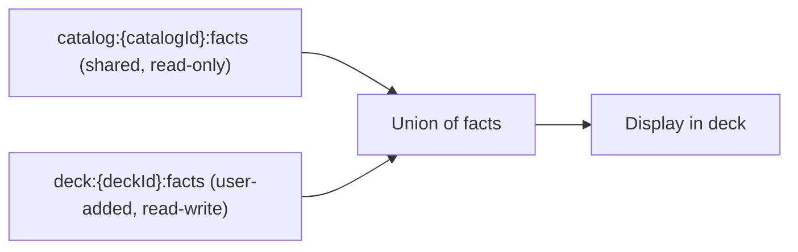
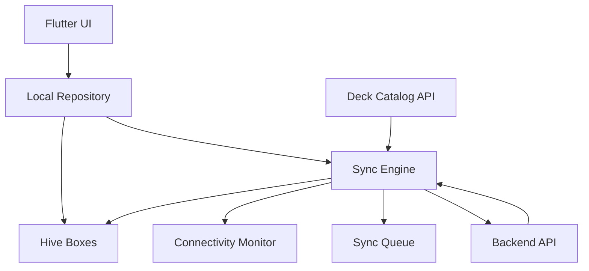
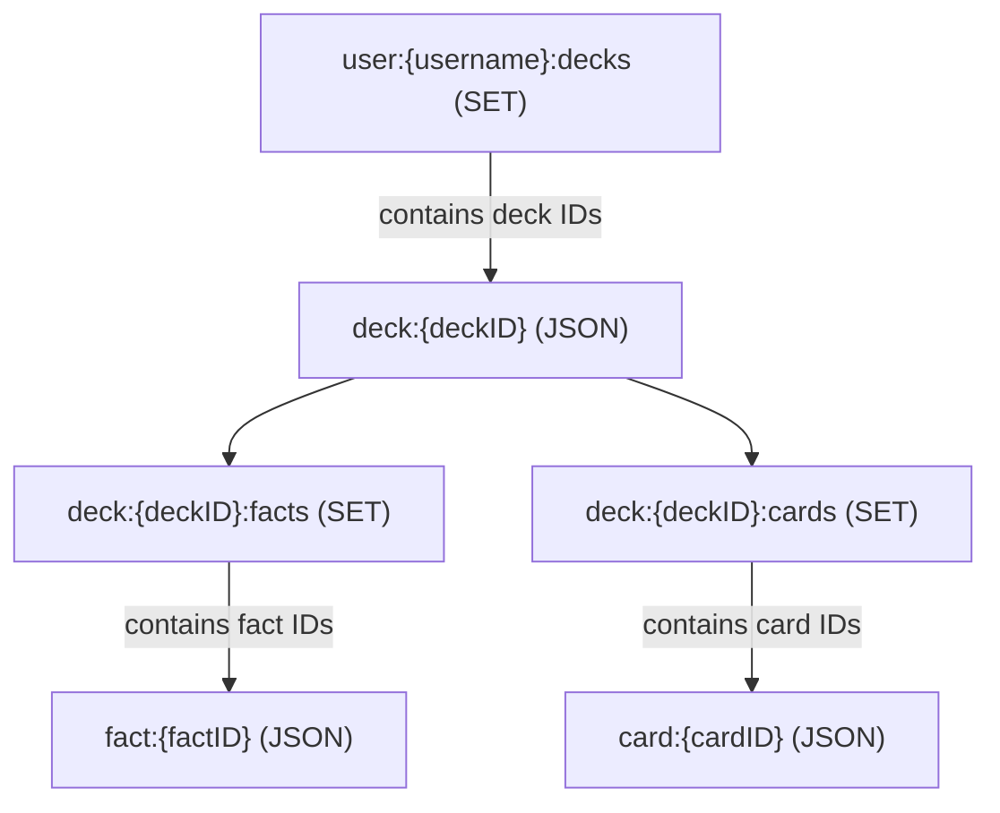
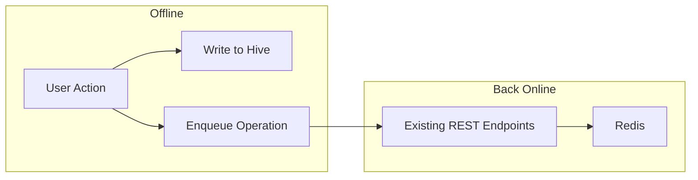
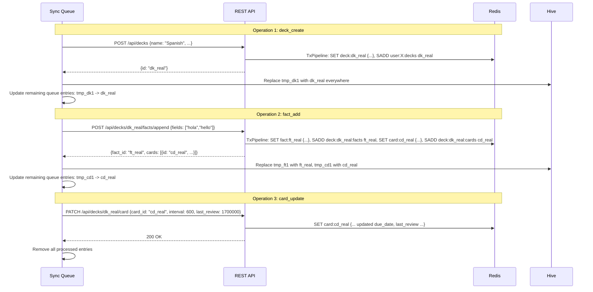
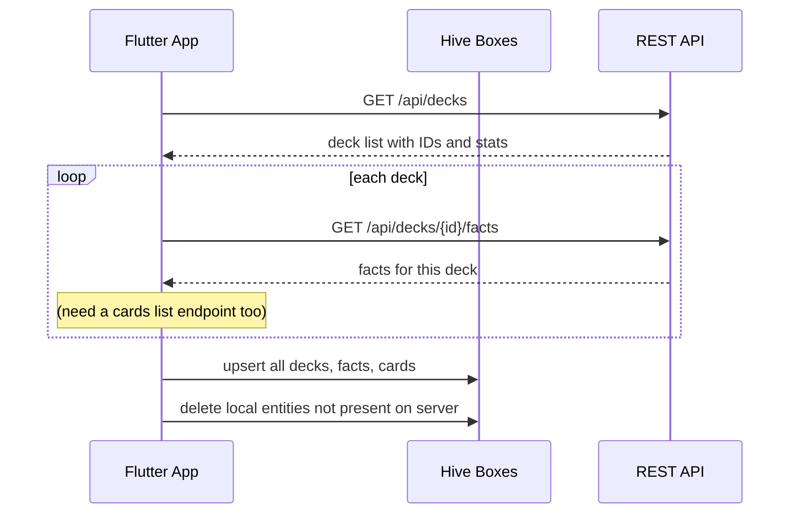

# Offline-First Review and Deck Management

## Current State

- **Frontend review is incomplete**: no card update API call, no fact content display, `Card` model missing `id`, endpoint path mismatch (`/urgent-card` vs `/card`)
- **Hive exists** but only stores theme state in a single `hydrated_box`
- **No connectivity detection**, no sync queue, no local card/fact/deck cache
- **All scheduling logic** (urgency, next card, min/max interval, spread) lives in Go on the server

## Two Sources of Decks

Decks come from two sources with different ownership models:

### Pre-made decks (catalog)

Curated decks downloaded from a server-side catalog. Content is **shared** across all users who install the deck.

- **Shared (one copy)**: deck metadata (name, fields, templates), facts, media files — stored in `catalog:` and `catalog_fact:` Redis keys
- **Per-user**: cards (scheduling data — each user gets their own set)
- **Read-only**: users cannot edit the shared catalog content
- **User overlay**: users can add their own facts on top of the shared content. User-added facts live in the user's own `fact:` keyspace and are fully editable/synced. The deck displays the union of shared catalog facts + user-added facts.
- **Automatic corrections**: since shared facts are referenced (not copied), corrections by the catalog author are instantly visible to all users — no per-user update needed
- **Manual updates for new content**: if the catalog author adds new facts, users can trigger an update to pull the new facts and create cards for them

### User-created decks

The user authors their own content. Everything is user-owned.

- **Per-user**: deck metadata, facts, media, and cards are all owned by the user
- **Read-write**: user can edit anything
- **Synced**: all content syncs to the server

### Data ownership summary

| Data | Pre-made deck | User-created deck |
|---|---|---|
| Deck metadata | Shared, read-only | Per-user, read-write, synced |
| Catalog facts | Shared, read-only, auto-corrected | N/A |
| User-added facts | Per-user, read-write, synced | Per-user, read-write, synced |
| Media files | Shared, read-only | Per-user, read-write, synced |
| Cards | Per-user, synced | Per-user, synced |

### How the overlay works

When loading facts for a pre-made deck, the system unions two sources:



- Shared facts (`catalog_fact:{id}`) — referenced by all users, corrections apply automatically
- User-added facts (`fact:{id}`) — owned by the user, fully editable, synced normally
- Cards for both types are per-user and work identically

This avoids duplication (shared facts are stored once), avoids merge conflicts (user can't edit shared facts), and gives automatic corrections for free.

### Backend: catalog endpoints

New endpoints for the catalog:

- `GET /api/catalog` — list available pre-made decks (public, not tied to any user)
- `GET /api/catalog/{id}` — get catalog deck details (shared facts, templates, etc.)
- `POST /api/catalog/{id}/install` — install a catalog deck for the current user: creates the user's deck entry (with a `catalogId` reference) and generates per-user cards pointing to the shared facts
- `POST /api/catalog/{id}/update` — pull new facts added since last install/update, create cards for them

Catalog data is stored separately in Redis (e.g., `catalog:{id}`, `catalog:{id}:facts`, `catalog_fact:{id}`) and managed by admins. When a user installs a catalog deck, their `deck:{id}` entry includes a `catalogId` field. Loading facts for such a deck means: `SMEMBERS catalog:{catalogId}:facts` UNION `SMEMBERS deck:{deckId}:facts`.

### Hive: local storage by deck type

For **pre-made decks**:
- Cache shared content (deck metadata, catalog facts) in Hive as read-only — used for offline display, auto-corrected on next pull
- Store user-added facts in Hive as read-write — synced
- Store per-user cards in Hive as read-write — synced

For **user-created decks**:
- Store everything (deck, facts, cards) in Hive as read-write — all synced

The Local Repository and scheduling logic treat both types identically for review — a card points to a fact (shared or user-owned), and the scheduling math is the same either way.

## Architecture: Offline-First with Background Sync



- **Local Repository** is the single data source for all UI reads
- **Sync Engine** pushes queued changes when online and pulls fresh data from the server
- **Deck Catalog** provides pre-made decks for download; once installed they become regular user decks
- UI never calls the API directly during review — it always goes through the local repo

## Phase 1: Fix Frontend Gaps (prerequisite)

Before offline work, fix the incomplete online flow:

- Add `id` field to `CardDetail` model (`frontend/lib/models/card.dart`)
- Create a `Fact` model (`id`, `fields`)
- Fix endpoint path: `/urgent-card` -> `/card` to match backend routes
- Implement the PATCH call in `CardService` to submit reviews (`card_id`, `interval`, `last_review`)
- Wire up Hard/Good/Easy buttons in `DeckLearnScreen` to map to intervals within `[minInterval, maxInterval]` and call the PATCH endpoint
- Display fact content (fetch fact by `factId`, use `templateIndex` + deck `templates` to show front/back)

## Redis Data Structure

The backend stores all data in Redis using two types of keys:

**Entity keys** (JSON blobs):

- `user:{username}` — user profile
- `deck:{deckID}` — deck metadata (name, fields, templates, rate, owner, etc.)
- `fact:{factID}` — fact content (id, fields)
- `card:{cardID}` — card scheduling data (id, fact_id, template_index, last_review, due_date, hidden, min_interval, max_interval, created_at)

**Membership sets** (indices linking entities):

- `user:{username}:decks` — SET of deck IDs owned by the user
- `deck:{deckID}:facts` — SET of fact IDs in the deck
- `deck:{deckID}:cards` — SET of card IDs in the deck



Cards have no `deckId` field — the only way to know which deck a card belongs to is via the `deck:{deckID}:cards` set.

## Phase 2: Local Data Layer (Hive)

Set up dedicated Hive boxes for offline data. Hive boxes are flat key-value stores that map naturally to the Redis per-key pattern:

| Redis | Hive equivalent |
|---|---|
| `deck:{id}` JSON | `decks` box, key = deck ID |
| `fact:{id}` JSON | `facts` box, key = fact ID |
| `card:{id}` JSON | `cards` box, key = card ID |
| `user:X:decks` SET | Not needed — list all entries in `decks` box |
| `deck:X:facts` SET | Not needed if `deckId` is added to the Fact model |
| `deck:X:cards` SET | Not needed if `deckId` is added to the Card model |

Hive boxes:

- **`decks` box** — keyed by deck ID, stores full deck metadata (name, fields, templates, rate, etc.)
- **`cards` box** — keyed by card ID, stores card scheduling data (id, deck_id, fact_id, template_index, due_date, interval, min_interval, max_interval, hidden, created_at)
- **`facts` box** — keyed by fact ID, stores fact content (id, deck_id, fields)
- **`sync_queue` box** — ordered list of pending operations to push to server

Key difference from Redis: add a `deckId` field to Card and Fact on the client side. This replaces the Redis membership sets — "get all cards for deck X" becomes a filter by `deckId` instead of an SMEMBERS call. This field can be client-only or added to the backend Card/Fact structs for consistency.

Consider storing `interval` + `due_date` on the card (instead of `last_review` + `due_date`) — this simplifies urgency to `(now - due) / interval` and avoids reconstructing the interval everywhere.

Each box should use a Hive `TypeAdapter` for type-safe serialization with `hive_ce`.

## Phase 3: Port Scheduling Logic to Dart

Replicate these algorithms from `backend-api/deck/card.go` and `backend-api/deck/fact.go` in a new Dart directory (e.g., `frontend/lib/services/scheduling/`):

- **Get next card**: iterate all non-hidden cards, compute `urgency = (now - dueDate) / interval`, pick max urgency (~15 lines of logic, card.go lines 234-269)
- **Min/Max interval**: `minFactor=0.5`, `maxFactor=4.0`, scale by urgency when card is not yet due (~15 lines, card.go lines 286-304)
- **Update card**: `dueDate = lastReview + chosenInterval`, validate interval in `[min, max]` (~5 lines, card.go lines 509-521)
- **SpreadCards**: slot-based interleaving of new cards into unseen queue (~35 lines, fact.go lines 100-135)
- **New card scheduling**: gap = 86400 / rate, assign `dueDate` = startTime + i * gap (~10 lines, fact.go lines 339-342)
- **ComputeStats**: unseen/due/hidden/reviewed counts (stats.go)

All of these are pure functions (no I/O) and should be unit-testable in Dart.

## Phase 4: Local Repository

A `LocalRepository` class that wraps Hive and the scheduling logic:

- `getNextCard(deckId)` — reads cards from Hive, runs urgency algorithm, returns card + fact content
- `submitReview(cardId, interval, lastReview)` — updates card in Hive, enqueues sync operation
- `addFact(deckId, fields, placement)` — creates fact + cards in Hive, runs spread algorithm, enqueues sync
- `createDeck(name, fields, templates, rate)` — creates deck in Hive with a temp ID, enqueues sync
- `getDeckStats(deckId)` — computes stats locally from Hive data
- `rescheduleDeck(deckId, days)` — shifts all cards locally, enqueues sync

## Phase 5: Sync Engine

### Key insight: no separate sync API needed for v1

The existing REST endpoints already handle all Redis writes. Each endpoint validates input, reads/writes Redis entity keys and membership sets, and returns a response. The sync engine is purely a **client-side queue** that replays the same API calls the frontend would have made if it had been online.



No new backend code is required. The sync engine calls `POST /api/decks`, `PATCH /api/decks/{id}/card`, etc. — the same endpoints the app would call in real time. Each endpoint already handles the Redis writes internally (entity keys + membership sets via `TxPipeline`).

### Connectivity monitor

Add `connectivity_plus` to detect online/offline state.

### End-to-end example

User goes offline, creates a deck, adds a fact, reviews a card, then comes back online.

**Step 1 — Offline actions write to Hive and enqueue operations:**

| User action | Hive write | Queue entry |
|---|---|---|
| Create deck "Spanish" | `decks` box: `tmp_dk1 -> {name: "Spanish", ...}` | `{type: "deck_create", tempId: "tmp_dk1", payload: {...}}` |
| Add fact ["hola", "hello"] | `facts` box: `tmp_ft1 -> {fields: [...], deckId: "tmp_dk1"}`, `cards` box: `tmp_cd1 -> {..., deckId: "tmp_dk1"}` | `{type: "fact_add", deckId: "tmp_dk1", payload: {fields: [...], placement: "append"}}` |
| Review card (interval=600) | `cards` box: update `tmp_cd1` due_date/interval | `{type: "card_update", deckId: "tmp_dk1", cardId: "tmp_cd1", payload: {interval: 600, last_review: 1700000}}` |

**Step 2 — Back online, push queued operations through existing endpoints:**



**Step 3 — Full pull to refresh local cache:**



Note: `GET /api/decks/{id}` returns only deck metadata + stats (no facts, no cards). Facts come from `GET /api/decks/{id}/facts`. A card list endpoint does not currently exist — either add one, or skip the full pull for cards and trust the push was successful.

### Sync queue format

```json
[
  { "type": "deck_create",    "tempId": "tmp_abc", "payload": {...}, "timestamp": 1700000001 },
  { "type": "fact_add",       "deckId": "tmp_abc", "payload": {...}, "timestamp": 1700000002 },
  { "type": "card_update",    "deckId": "tmp_abc", "cardId": "tmp_cd1", "payload": {...}, "timestamp": 1700000003 },
  { "type": "deck_reschedule","deckId": "dk_real", "payload": {...}, "timestamp": 1700000004 }
]
```

### Operation mapping to existing endpoints

Each queue entry maps to an existing REST endpoint — no new backend routes needed:

- `deck_create` -> `POST /api/decks`
- `deck_update` -> `PATCH /api/decks/{id}`
- `deck_delete` -> `DELETE /api/decks/{id}`
- `fact_add` -> `POST /api/decks/{id}/facts/{operation}`
- `fact_update` -> `PATCH /api/decks/{id}/facts/{factId}`
- `fact_delete` -> `DELETE /api/decks/{id}/facts/{factId}`
- `card_update` -> `PATCH /api/decks/{id}/card`
- `deck_reschedule` -> `POST /api/decks/{id}/reschedule`

### Ordering and idempotency

- **Order matters**: a deck must exist on the server before its facts can be synced. Queue entries are processed sequentially.
- **Temp ID resolution**: after each create operation, replace the temp ID in Hive and in all subsequent queue entries that reference it.
- **Idempotency**: card updates are naturally idempotent (last write wins). Deck/fact creation is not — if a push fails midway and retries, check whether the entity already exists before re-creating.

### What doesn't need syncing

- **min_interval / max_interval**: recomputed on every GetNextCard call, both server-side and client-side
- **Stats**: purely derived from card data, computed locally
- **Urgency**: computed on the fly, never stored

### Conflict resolution

- **Card updates**: last-write-wins based on `last_review` timestamp
- **Deck/fact creation**: server is authoritative on IDs; client replaces temp IDs after sync
- **Deletions**: if the server says an entity is gone (not returned in full pull), remove it locally. If the client deleted something offline, the delete operation in the queue handles it.

### v2 optimization: bulk sync endpoint

For v1, sequential API calls are sufficient. If performance becomes an issue (many queued operations on a slow mobile connection), a dedicated `POST /api/sync` endpoint can batch all operations into a single HTTP call and process them in one Redis `TxPipeline`:

```json
POST /api/sync
{
  "operations": [
    { "type": "deck_create",  "temp_id": "tmp_1", "payload": {...} },
    { "type": "fact_add",     "deck_id": "tmp_1", "payload": {...} },
    { "type": "card_update",  "deck_id": "tmp_1", "card_id": "tmp_c1", "payload": {...} }
  ]
}

Response:
{
  "id_mapping": { "tmp_1": "dk_real", "tmp_c1": "cd_real" },
  "results": [
    { "status": "ok" },
    { "status": "ok" },
    { "status": "ok" }
  ]
}
```

This is a nice-to-have — ship with sequential calls first.

## Phase 6: UI Integration

- Replace direct API calls in `DeckLearnScreen` with `LocalRepository` calls
- Add offline indicator (banner or icon) when connectivity is lost
- Show sync status (pending count, last synced time)
- Deck list reads from Hive (instant load) with background refresh when online

## Backend Changes

- Consider adding `interval` field to the Card struct and storing it alongside `due_date`, dropping `last_review` from persisted state (option 3). This aligns backend and frontend on the same minimal card representation. `last_review` remains an input-only field in the PATCH request.
- Add a bulk sync endpoint (e.g., `POST /api/sync`) that accepts a batch of queued operations — this avoids N sequential API calls on reconnect.

## Key Risks

- **Data drift**: if the user reviews on two devices offline, the sync merge could be tricky. Start with single-device assumption; multi-device sync is a future concern.
- **Temp ID mapping**: when offline-created decks/facts get real server IDs, all local references (cards pointing to facts, etc.) need updating atomically.
- **Hive performance**: with large decks (1000+ cards), iterating all cards for urgency calculation should still be fast in Dart, but worth benchmarking.
