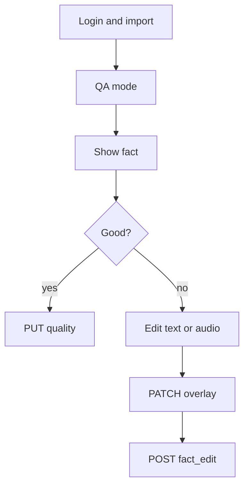

# QA mode (imported decks)

**Status:** shipped (`lib/screen/qa/`).  
**Related:** [api.md](api.md) [Fact quality](api.md) — reuse **`PUT /api/decks/{id}/facts/{factId}/quality`**. No `…/verify` contribution.

Human QA logs in, **imports** the catalog, **QA mode** (linear walk, not SRS). Each **column (entry)** has a checkbox. Header: **verified entries / total entries** (`model=human`) and **edited** (`fact_edit`).

## Workflow

1. Import → deck menu **QA mode** (`isImported` only).
2. Walk facts (Prev/Next; optional 課). Show every column (label from `deck.fields`) with text/audio and a **checkbox**.
3. Check the columns that are OK (headword, example, …). Unchecked = not signed off. Pre-check columns that already have `model: human` on GET quality.
4. **Verified** sends quality **only for checked columns**. Confirm sheet shows that PUT JSON.
5. **Bad column → Edit** that text/audio. `PATCH` overlay, then **immediately** `POST …/edit`. Do not PUT `human`/10 on a column until it is checked + Verified (or after author **accept**, then QA checks it).
6. Report issue stays `POST …/report` (bugs only).



## Verified: reuse quality PUT

```http
PUT /api/decks/{importDeckId}/facts/{factId}/quality
Authorization: Bearer <token>
Content-Type: application/json
```

Quality is **already per entry index** (`"0"`, `"2"`, …). Checked columns → those keys only. For a checked column, include `text` and/or `audio` if that entry has them. Score **10**, `model: "human"`. Confirm sheet lists checked field names + JSON. Disable Verified if nothing is checked.

Example: reviewer checks 日文 (0) and 例句 (2), not 中文 (1) or 例句中文 (3):

```json
{
  "entries": {
    "0": {
      "text": { "score": 10, "model": "human" },
      "audio": { "score": 10, "model": "human" }
    },
    "2": {
      "text": { "score": 10, "model": "human" },
      "audio": { "score": 10, "model": "human" }
    }
  }
}
```

**PUT replaces the whole record.** Client **GET** quality first (404 → empty), merge the checked aspects, then PUT. Unchecked columns keep prior AI/`human` scores. Unchecking a previously human column: drop that aspect from the merged PUT (back to omitted / leftover AI if still in GET).

**200** `data.quality` as now (`fact_id`, `entries`, `updated_at`, `verified_by` when human verification). After success, those checkboxes stay on (`human`).

Import deck owner may **PUT** quality for facts in the pinned snapshot (writes `fact:{factId}:quality` — the author's regen data). **403** if not the import owner (or source owner on source decks). Learners must not get a general quality editor.

**Username:** quality has no `reporter`. Server sets **`verified_by`** from the JWT on the quality record (omit from client body). Author: `GET …/facts/{factId}/quality` or `GET …/quality?model=human`.

Counts: **verified entries** = aspects (or columns) with `model=human` across the deck vs **total** scoreable columns (entries with text or audio × facts). Also show per-fact `2 / 4` columns. Edited = submitted `fact_edit`s.

## Edit: overlay then `fact_edit`

Existing importer APIs. [api.md](api.md) — *Fact edit (current overlay)*. Client: `DeckCatalogService.submitFactEditContribution`. QA reuses `FactEdit` unchanged, so the row it stages goes out immediately: `QaModeCubit.submitEdit` POSTs on `onSaved` and marks the staged row as sent, leaving nothing in the outbox.

**1. Write the private overlay** (not a contribution yet).

New audio: `POST /api/media` (`deck_id={importDeckId}`), then put the media id on that entry.

```http
PATCH /api/decks/{importDeckId}/facts/{factId}
Authorization: Bearer <token>
Content-Type: application/json
```

```json
{
  "entries": [
    { "text": "[[建|た]]てます", "audio": "newaud0001" },
    { "text": "to build" },
    { "text": "[[来年|らいねん]]、[[新|あたら]]しい[[家|いえ]]を[[建|た]]てます。", "audio": "exaud00001" },
    { "text": "I will build a new house next year." }
  ]
}
```

`entries` **replaces** the whole fact. Keep unedited columns as they are (including audio ids). Fail here → do not POST edit.

**2. Freeze overlay for the author.**

```http
POST /api/decks/{importDeckId}/contributions/facts/{factId}/edit
Authorization: Bearer <token>
Content-Type: application/json
```

Body optional. **Do not send `type` or `entries`.** The server copies the current overlay into `proposed_entries` and the pinned snapshot into `reported_fact`. `reporter` is the JWT username.

| Field | Required | Meaning |
|-------|----------|---------|
| `message` | no | Note in the inbox; QA can send `"QA edit"` |
| `entry_index` | no | Column the reviewer changed (`0` = first `fields[]` label). Helps the author jump to that entry. Send the checkbox/row they edited. |

```json
{
  "entry_index": 0,
  "message": "QA edit"
}
```

Requires: import owner; `{factId}` in the pinned snapshot; overlay **exists** and **differs** from the snapshot. Open row with dedupe `fact_edit:{factId}` for this reporter is **refreshed** (no extra quota). New row counts toward `contributionDailyLimit` (`contribution.go`; toast **429**).

**201:**

```json
{
  "data": {
    "contribution_id": "cont0001",
    "source_deck_id": "srcdeck12345",
    "import_deck_id": "impdeck12345",
    "fact_id": "fact0001",
    "type": "fact_edit",
    "reporter": "yuki",
    "source_version": 15,
    "status": "open",
    "entry_index": 0,
    "message": "QA edit"
  },
  "meta": { "msg": "contribution submitted" }
}
```

Author: `GET /api/decks/{sourceId}/contributions?type=fact_edit` (optional `reporter=`). **Accept** copies `proposed_entries` onto the source working copy; author still **publishes**. Overlay save without this POST never reaches the author.

| Status | Typical `msg` |
|--------|----------------|
| **400** | `overlay required: fact has no private overlay`, `overlay must differ from snapshot`, `fact not found` |
| **403** | Not import owner / `contributions are only available on imported decks` |
| **429** | `daily contribution limit exceeded` |

Fail POST after a good PATCH: overlay is saved locally; toast; retry POST. Do not PUT quality `human`/10 on the edited column until the author accepts (or QA verifies the published snapshot later).

## Queue / UI

Fact ids come from one `GET …/facts/ids` (`CardService.listFactIds` → `data.fact_ids`). Before the walk, the reviewer picks which deck columns to include (saved per import deck in `SharedPreferences`); the picker lists every deck column with its deck-wide completion % from `GET …/quality/stats`. Only selected columns appear during the walk and count toward verify. Re-open the picker from the app bar to change columns mid-walk. Header shows fact progress, each active column’s completion %, and edited count. One row per active entry (`FactContent` inline + checkbox, `deck.fields[i]`). Audio uses snapshot `media_versions` from `GET .../facts/{factId}` (`/api/media/{id}?v={pinned}`), not deck `source_version` (copy-on-write media often pins an older `v`). Cubit: `factIds`, `index`, `activeColumnIndexes`, `checkedEntryIndexes`, outside `DeckStudyBloc`.

## Checklist

- [x] Allow quality PUT on **imported** decks (snapshot facts only); stamp `verified_by` from JWT.
- [x] Tests: import PUT 200; merge via GET+PUT; 403 other user; source PUT still works.
- [x] Flutter: per-column checkboxes; PUT only checked indexes; GET+merge; counts; auto `fact_edit`.
